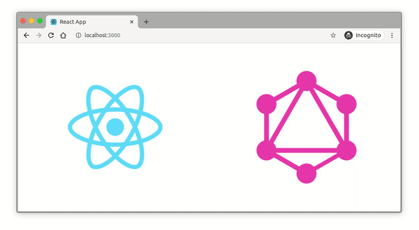

## Description

Infinite scrolling slideshow created with the new library <a href='https://styled-components.com/'>styled-components</a>.



## Features

There are several parameters:

- speed
- image height
- image width

## How to play with it

- Clone the repo:

```
~$ git clone https://github.com/AchrafAsh/react-styled-components-infinite-scroll-slideshow.git
```

- Install packages:

```
~$ npm install
```

- Run:

```
~$ npm start
```

- Check it on `localhost:3000`

- Play with it:
  
